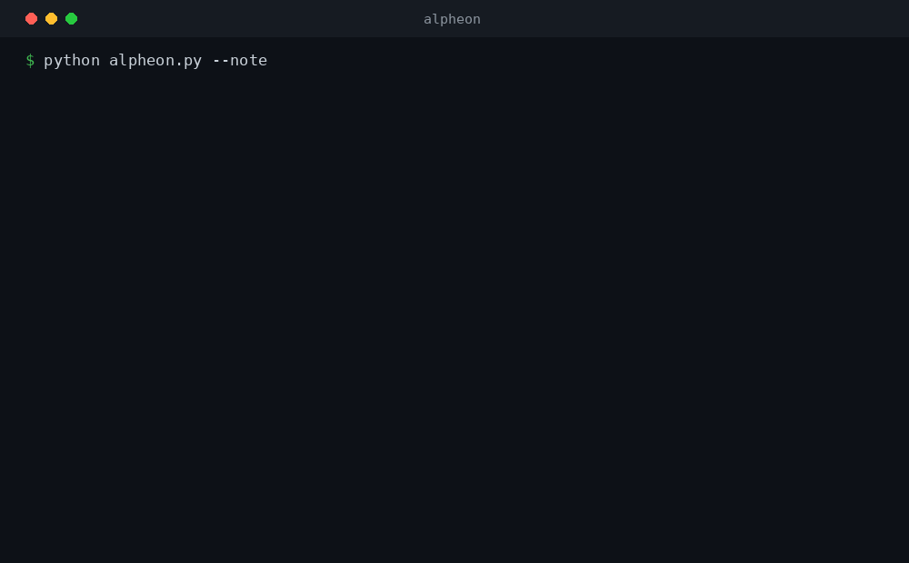

# Alpheon

**Alpheon: remember the *why* behind your code.**

[](LICENSE)
[](https://www.python.org/)


[](CONTRIBUTING.md)

Alpheon is a small, dependency-free CLI that turns your git diff into a reviewable **Handoff Note**: what changed, *why* it changed, what you tried and rejected, and what's left to do. One markdown file, committed with your code, readable by your next AI session, your next tool, or the teammate who opens the project after you.



```bash
git clone https://github.com/BravoAlphaSix/alpheon.git
python alpheon.py    # run inside any git repo, review the draft, save the why
```

## The problem

When you work with an AI coding assistant, the reasoning behind your code (why you chose this approach, what you tried that failed, what tradeoff you made) lives entirely inside that one chat session. The moment the session ends, or you switch tools, or a teammate opens the repo, that reasoning is gone. The code remains. The *why* doesn't.

Most memory tools store **facts** (what the code does, what the API looks like) so an AI can retrieve them later. A few newer ones chase the reasoning too, but nearly all of them are MCP servers you wire into a specific agent, backed by a database next to your repo. Alpheon takes the opposite bet: no server, no database, no agent lock-in. It works off git, so it doesn't care whether you use Claude Code, Cursor, Copilot, or no AI at all, and the reasoning lands as plain markdown a human reads, committed with the code.

## How it works

1. **You code** with an AI assistant, solo, or both. Alpheon doesn't care how the changes were made, only that git can see them.
2. **You run `alpheon.py`** at a natural checkpoint (end of session, before a commit, before you hand off the branch).
3. **Alpheon reads your git diff** (changed files, diff stat, recent commits) and drafts a Handoff Note with sections for what changed, why, what was rejected, and what's next.
4. **You review and approve** before anything is saved. Nothing is written to disk until you say yes, so a bad or hallucinated "why" never silently becomes truth. The note is appended to `HANDOFF.md` in your repo, versioned right alongside the code it describes.

## A real example

Here's what a Handoff Note looks like after switching an in-memory dict cache to SQLite, having tried and rejected Redis along the way:

~~~markdown
## Handoff Note (2026-07-14 22:41)

### What changed
- **modified**: `cache.py`
- **added**: `cache_sqlite.py`
- **deleted**: `cache_memory.py`

### Why
Needed the cache to survive process restarts. The in-memory dict was losing
all entries on every deploy, causing a cold-cache stampede. Sqlite gives us
persistence with zero infra to run.

### What was tried & rejected
Tried Redis first. Worked, but added a whole service to deploy, monitor, and
pay for just to cache ~50MB of data. Way too heavy for what we actually need.
Dropped it in favor of a single sqlite file that ships with the app.

### What's next / open questions
Need a TTL/eviction policy. Right now the sqlite file just grows. Also
should benchmark read latency under load before trusting this in prod.

<details><summary>Change details (auto)</summary>

Recent commits:
- switch cache backend to sqlite
- wip: try redis for persistent cache
- add cache invalidation tests

Diff stat:
```
 cache.py           | 42 ++++++++++++++++++------------------
 cache_sqlite.py     | 58 +++++++++++++++++++++++++++++++++++++++++++++++++++
 cache_memory.py      | 31 -------------------------------
 3 files changed, 85 insertions(+), 46 deletions(-)
```
</details>

---
~~~

More examples, including a multi-note handoff history, are in [`examples/HANDOFF.md`](examples/HANDOFF.md).

## Quick start

No install, no signup, no config file. Just Python 3 and git.

```bash
git clone https://github.com/BravoAlphaSix/alpheon.git
cd your-project        # cd into the repo you want to summarize
python /path/to/alpheon.py
```

**Summarize your uncommitted changes** (the default: staged + unstaged diff against `HEAD`):

```bash
python alpheon.py
```

**Summarize everything since a given commit or branch:**

```bash
python alpheon.py --since HEAD~1
python alpheon.py --since main
```

**Add your own "why" instead of leaving it as a fill-in-the-blank:**

```bash
python alpheon.py --note "tried Redis, too heavy for 50MB of data, switched to sqlite"
```

**Skip the confirmation prompt** (for scripting into a pre-commit hook, etc.):

```bash
python alpheon.py --yes
```

Every run prints the draft note first. Nothing touches `HANDOFF.md` until you confirm.

## Why Alpheon is different

| | Other memory tools | Alpheon |
|---|---|---|
| What it stores | Facts about your code | The reasoning behind your code |
| Setup | Accounts, servers, vector DBs | None, one Python file |
| Where data lives | Their cloud / a database | A markdown file in your own repo |
| Trust model | Auto-written, auto-trusted | You review and approve every note |

Alpheon isn't trying to be a database, a memory layer, or a cross-tool sync engine. It does one thing: capture the *why*, in plain markdown, under your control.

## Roadmap

The free tool you're looking at is a template generator. It structures the note and drops in what git already knows (files, diff stat, commit log); you fill in the reasoning. That's deliberate: it's dependency-free, runs instantly, and never invents a "why" you didn't confirm.

Coming next:
- **AI-written first drafts** of the "why," "rejected," and "next steps" sections, generated from your diff and session transcript, still reviewed by you before anything is saved.
- **Project history search**: ask "why did we do X" and get the actual Handoff Note that answered it.
- **Team handoffs**: shared context when a teammate picks up a branch, without a shared account or server.

## Contributing

Bug reports, feature ideas, and pull requests are welcome. See [CONTRIBUTING.md](CONTRIBUTING.md).

## License

MIT. See [LICENSE](LICENSE). Use it, fork it, ship it.
